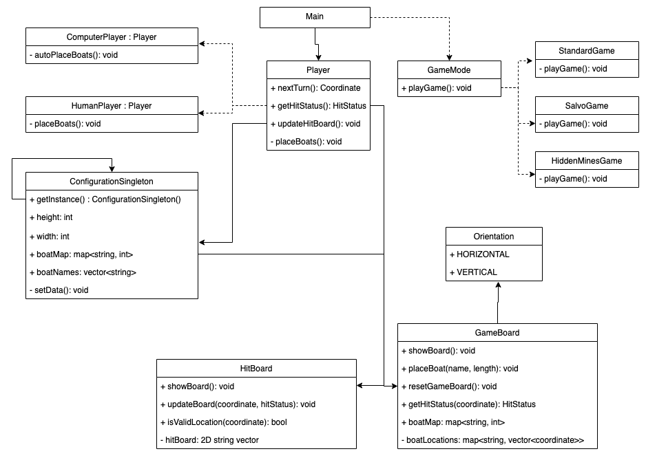

## AP 2 - Battleships

Repl link: https://replit.com/@BhupinderSD/Battleships

Repl invite link: https://replit.com/join/vijspmcj-bhupindersd


## Challenge outline


### Summary and proposed solution

The challenge that I have to complete is to design and create “AdaShip”, a clone of the classic battleships game. Battleships is a turn based strategy/guessing game. AdaShip is a command line variant of battleships. I will be expected to create multiple game modes along with player types, so efficient use of good programming skills and OOP will help with programming AdaShip.

There are a large number of requirements for all aspects of the challenge. Below are my initial thoughts and the proposed solution.


#### Configuration

The board size, boat names, length and count must all be customisable in an `adaship_config.ini` file. I think that this will be best implemented as a singleton class, since we only need to read the config data once at runtime and we can use the same data for the rest of the program's run time.


#### Board

The board must use a fixed coordinate notation, where the y axis is represented by numbers and the x axis is represented by the alphabet (and if the board is wider than 26 units, the alphabet must repeat again, so after Z is AA). So that the board is displayed correctly and evenly spaced, I will pad every cell in the board to the same width. I will need to create two boards, one to represent the game board and all the boats on it, and the second to represent the hit board and where the player has hit the other player in past turns.


#### Game modes and Menu

I will be implementing the following game modes:


*   Player v Computer
*   Player v Player
*   Player v Computer (salvo)
*   Player v Player (salvo)
*   Player v Computer (hidden mines)
*   Player v Player (hidden mines)
*   Computer v Computer (hidden mines)

I will present this menu from main and I plan to keep it very simple so that it is easy to add more game modes and player combinations.

The standard game mode is the same as a normal battleships game. Each player can take one shot at the other player's boat before ending their turn. In the salvo game mode, each player can shoot a torpedo for every ship they have remaining on their board on their turn. The hidden mines game mode adds 5 randomly dropped mines onto each player’s boards. When a mine is hit, it and the immediately surrounding valid coordinates are also hit. Apart from this, the gameplay is the same as the standard game mode.


#### Players

I will need to support two players, a human player and a computer player. In order to reuse code, and since both players will need to do the same things, I think that it will be best to use an abstract player class, which will be inherited by a human and computer class. This will let me reuse code since I can use the general players base class as a parameter to functions and methods and call the common virtual methods that both subclasses implement.

The human player has the ability to place their boats manually, or to auto place them or a combination of both. When firing a torpedo, they can choose coordinate to fire at or choose to auto fire as well. The computer player always places and fires automatically. I will add an advanced targeting algorithm so the user can decide if the computer player should use the default or improved targeting method.


### UML diagram




### Initial working plan

My overall approach to this project will be to complete everything to a high standard. I will write detailed commit messages and refactor my code whenever I think that something can be done better. I will also test new and existing features after every commit and I will also test my code on Repl frequently to ensure that it will still work. My development strategy will be to split the several components into their own directories and ensure that they can all work together. I will use the clion ide to help with debugging whenever required. As visible in my UML diagram above, multiple components communicate with each other. Ensuring that all components work together will be vital. I will add detailed comments as I go, so that I know what a method does and any implementation details as well.


### Analysis and decomposition

As shown in the UML diagram, proposed solution and explained above, the components for this challenge will be the epics.


*   Epic 1 - Parsing the configuration
*   Epic 2 - Player(s)
*   Epic 3 - Boards
*   Epic 4 - Game modes

I explain how I will break down these epics and why I chose them in the section below.


### Object orientated design ideas and phased breakdown

The epic numbers above is the general order in which I will create the program. Since I will not be using hardcoded configuration data, it makes sense to create a working configuration parser first. This will make it easier to create and test the game board and hit board. However, I will create a player before the boards so that I can try to place data on the board. Once the game and hit boards are working correctly, I can work on implementing the other game modes.

As explained in the proposed solution section above, the configuration parser will be a singleton class. I will only need to read the configuration data the first time I need it, and every time it is accessed after that, I can retrieve it from the same initial instance. This approach makes sense since I don’t expect or support the configuration data changing during runtime.

Using abstract classes for the players and game modes will allow me to reuse the same methods in main, which will display the game menu. This will help with readability and also reduce code duplication.

In order to test all the epics to a minimally viable solution, I will first implement a player vs player game with the standard game mode. This will let me test the game board and hit board logic. Once all edge cases and bugs are resolved, I can start implementing the rest of the game modes and the computer player.

There will be some code that can be shared between components and subclasses, so I will place these as helper functions in a shared directory. An example for this could be any printing logic and input selections.


## Development


### Use of good standards

Since C++ is a new language to me, I thought it would be best to use an ide such as clion. This will help me with minor mistakes that I make, auto imports and also small optimisations that I can make that I miss, such as making a parameter constant.

In order to help myself and other viewers of my code, I will try to make sure that everything is as readable as possible. I will add method comments explaining what a method is doing as well as implementation comments when something that I am doing could be confusing.

I will be following the KISS principle and will keep the code as simple as possible. Using abstract classes should help with this. Meaningful variable and method names will also be really important. I will also try to make sure that commits only do one thing. This will make it easy to find when something was implemented and if there are any bugs, it can be easier to find out which commit may have caused it.


### Phase 1 - Parsing the configuration

The configuration file had to be in a specific format. The following are the default values.

```

Board: 10x10

Boat: Carrier, 5

Boat: Battleship, 4

Boat: Destroyer, 3

Boat: Submarine, 3

Boat: Patrol Boat, 2

```

As you can see, the board dimensions are set once but the key `boat` is used multiple times. For this reason, I chose to use a multimap<string, string>, where the key is either `Boat` or `Board` and the value is the text after `:`. I extracted a split method since I could reuse it to get the board dimensions, by splitting on `x`. I can also split by `,` in order to separate the boat name from the boat length.

```

/** Splits a string into a vector of strings, split by the specified delimiter. */

std::vector<std::string> split(const std::string &s, char delimiter) {

  std::vector<std::string> strings;

  std::stringstream sstream(s);

  std::string string;

  while(std::getline(sstream, string, delimiter)) {

    strings.push_back(string);

  }

  return strings;

}

```

Once I have extracted all of the data from the config file to the multimap, I validate it by ensuring that the multimap contains the board dimensions and a boat. If it does not, I let the user know and use default values so the user can continue to play the game.

After validating the multimap, I extract the data into fields of the singleton that can be retrieved later.

```

void ConfigurationSingleton::setConfigurationData(const std::multimap<std::string, std::string>& configMultiMap) {

  for (auto &itr : configMultiMap) { // Iterate through every key and value in the MultiMap.

    if (itr.first == BOARD_KEY) { // Check if the board dimensions have been set in the config file.

      setBoardDimensions(itr.second);

    } else if (itr.first == BOAT_KEY) { // Check if any boats have been set in the config file.

      addToBoatsMap(itr.second);

    }

  }

}

```


### Phase 2 - Players

Next, I created a HumanPlayer class. I created methods to ask the user for coordinates so that we can place boats (from the config singleton) on the board. For every boat to place, I ask for the orientation of the boat and then the starting coordinate for the boat. I also added validation and error handling for as many scenarios as I could think of.

Then, I continued to add more functionality to this class as well as the game board class. I also added support for moving placed boats and resetting the board. I then added support for auto placements, which I could then use for the Computer Player.


### Phase 3 - Boards

I worked on this at the same time as Players, since I would need both for testing and development. I use the board dimensions from the configuration singleton to render the board. One of the bigger challenges was creating the x axis and also parsing it from the user entered coordinates. I have explained this more in the reflections section below.

```

    // Split the x and y coordinates.

    for (char character : userCoordinates) {

      if (isalpha(character)) {

        tempCoordinates.x += toupper(character);

      } else if (isdigit(character)) {

        tempCoordinates.y = tempCoordinates.y * 10 + (character - '0');

      }

    }

```

I use this algorithm to split a userCoordinates string into the x and y coordinates. This algorithm goes through every character in the user entered string and, if it is a number, addes it to the end of the current y coordinate (after multiplying the current y coordinate by 10 since it needs to be in the next positional value). If it is a letter, I make it upper case and and it to the end of the x coordinates. I then check if the user entered the coordinates in the required notation and if they are missing any data, such as an x coordinate, y coordinates or if the provided coordinates are invalid. If the coordinates are valid, I exit a `while (true)` loop (so I can keep asking till I get valid coordinates) and return the coordinates.

```

    // Check that the coordinates are valid.

    if (tempCoordinates.x.empty() && tempCoordinates.y == 0) {

      std::cout << "Please enter valid coordinates.\n" << std::endl;

    } else if (tempCoordinates.x.empty()) {

      std::cout << "Please enter a valid x coordinate (a letter).\n" << std::endl;

    } else if (tempCoordinates.y == 0) {

      std::cout << "Please enter a valid y coordinate (a number).\n" << std::endl;

    } else if (!::isValidCoordinate(tempCoordinates)) {

      std::cout << tempCoordinates.x << tempCoordinates.y << "Please enter valid coordinates within the bounds of the board.\n" << std::endl;

    } else {

      tempCoordinates.y = tempCoordinates.y - 1; // Subtract 1 since the board index starts at 0.

      coordinate = tempCoordinates; // Set the temp coordinates as the coordinates to return.

      break;

    }

```


### Phase 4 - Game modes

During the development of the other epics, I implemented a standard game mode. Once the other epics were completed, I [extracted](https://github.com/BhupinderSD/Battleships/commit/92cbabcb154da235c8764ef31ff18a7236c8f573#diff-279f9cd7408d7bfb1d829678b72e3a03a16774f876bf898e5a69e5ddadd66589) the standard game mode into a new directory, using a base abstract class `GameMode` that is implemented by the different game modes. For a standard game mode, I ask the first player for their coordinates to fire at using `#nextTurn`. Then I pass this coordinate to the other player’s `#getHitStatus` which updates that player’s game mode if they were hit and returns the hit status type. Finally, I update the current player’s hit board with the hit status from the other player using `#updateHitBoard`. After this, I check if the hit status was a win, if so, `#playNextTurnAndMaybeFinish` will return `true`. Otherwise, I will ask the player (if they are a human) if they want to quit the game (to meet the AdaShip requirements), in which case I will return true as well. Otherwise, I will ask the user to press the enter key to end their turn, and since the game has not been won or quit, it will be the next player’s turn. This will repeat until a player has won or quit.

```

/** Plays the battleship game with a {@code gameMode} until a player wins or quits. */

void playGame(Player &player1, Player &player2, GameMode &gameMode) {

  while (true) {

    if (gameMode.playNextTurnAndMaybeFinish(player1, player2)) {

      break;

    }

    if (gameMode.playNextTurnAndMaybeFinish(player2, player1)) {

      break;

    }

  }

}

```

Since main is handling the menu, I thought that it should also handle running the loop until a game has been won or quit. As shown above, the code is very simple and this level of abstraction is very suitable for my purpose. It means that we can use the below code for a new game mode and player combination.

```

void playerVsComputerStandard() {

  HumanPlayer humanPlayer("Human Player");

  ComputerPlayer computerPlayer("Computer Player");

  StandardGame standardGame;

  playGame(humanPlayer, computerPlayer, standardGame);

}

```

```

void showMenu() {

  while (true) { // Ask the user to enter a game mode until they choose to quit.

    int option = getNumber("Please select a game mode: \n"

                           "1. Player v Computer\n"

                           "2. Player v Player\n"

                           "3. Player v Computer (salvo)\n"

                           "4. Player v Player (salvo)\n"

                           "5. Player v Computer (hidden mines)\n"

                           "6. Player v Player (hidden mines)\n"

                           "7. Computer v Computer (hidden mines)\n"

                           "0. Quit", 0, 7);

    switch(option) {

    case 1:

      playerVsComputerStandard();

      continue;

    case 2:

      playerVsPlayerStandard();

      continue;

    case 3:

      playerVsComputerSalvo();

      continue;

    case 4:

      playerVsPlayerSalvo();

      continue;

    case 5:

      playerVsComputerHiddenMines();

      continue;

    case 6:

      playerVsPlayerHiddenMines();

      continue;

    case 7:

      ComputerVsComputerHiddenMines();

      continue;

    case 0:

      std::cout << "Thanks for playing!" << std::endl;

      return;

    default:

      std::cout << "Invalid option, please try again." << std::endl;

      continue;

    }

  }

}

```

The method in main to show the menu is also really simple. I use a `while (true)` loop to ask the user to select a valid game mode till they choose to quit. To add a new player or game mode option, I just inform the user about the number for that option, increase the range in `#getNumber` to support the new option and add the number to the `switch` statement to execute the relevant game play.

This lets me easily add the other game modes, salvo and hidden mines. For salvo, I just ask the player for their next turn the same number of times as the number of their surviving ships.

```

/** Returns true if the player plays the next turn then wins or quits. */

bool SalvoGame::playNextTurnAndMaybeFinish(Player &player, Player &otherPlayer) {

  int playerTurns = player.getGameBoard().getSurvivingBoatCount();

  while (playerTurns > 0) {

    playerTurns--;

    Coordinate playerTorpedoLocation = player.nextTurn();

    HitStatus playerHitStatus =

        otherPlayer.getHitStatus(playerTorpedoLocation);

    player.updateHitBoard(playerTorpedoLocation, playerHitStatus);

    if (playerHitStatus == WIN) {

      player.waitToEndGame();

      return true;

    } else if (player.maybeQuitGame()) {

      return true;

    } else {

      player.waitToEndTurn();

    }

  }

  return false;

}

```

For the hidden mines game mode, the game play and the turns are the same as the standard game mode. However, I need to add 5 hidden mines on the player’s game boards. I do this after the boats have been placed on the boards.

```

/** Enables hidden mines for both plays and prints a message informing the user. */

void setHiddenMines(Player &player1, Player &player2) {

  player1.getGameBoard().setHiddenMines();

  player2.getGameBoard().setHiddenMines();

  std::cout << "Mines have been placed!\n" << std::endl;

}

```

I added support for this in `GameBoard`. While 5 mines have not been set, I am trying to add a mine at a random location that is valid and does not currently have a mine on it. If there is currently a boat where we want to place the mine, we can still place a mine down and we append `/M` to the boat initial to show the mine.

```

/** Sets 5 mines at random places on the board. */

void GameBoard::setHiddenMines() {

  int minesRemaining = 5;

  while (minesRemaining > 0) {

    Coordinate coordinate = getRandomCoordinates();

    if (!::isValidIndex(coordinate) || ::vectorContainsElement(mineLocations, coordinate)) {

      continue; // Don't add a mine here if the coordinates are invalid or a mine is already here.

    }

    std::string mineString;

    std::string boardIndex = ::getBoardIndex(gameBoard, coordinate);

    if (boardIndex == ::EMPTY_STATE) { // Check if we need to append the mine to a boat initial.

      mineString = ::MINE_STATE;

    } else {

      mineString = boardIndex + "/" + ::MINE_STATE; // Add the mine after the boat initial.

    }


<p id="gdcalert1" ><span style="color: red; font-weight: bold">>>>>  GDC alert: Definition &darr;&darr; outside of definition list. Missing preceding term(s)? </span><br>(<a href="#">Back to top</a>)(<a href="#gdcalert2">Next alert</a>)<br><span style="color: red; font-weight: bold">>>>> </span></p>


    ::setBoardIndexWithString(gameBoard, coordinate, mineString); // Set the mine on the board.

    mineLocations.push_back(coordinate); // Add this mine coordinate to the vector.

    minesRemaining--; // Decrease the counter since a mine has been placed.

  }

}

```


### Ensuring quality through testing and resolving bugs

During development and after any changes, big or small, I would run and play the game to ensure that I am meeting the user requirements and that the game is easy to understand and play. I created and added to a test plan that I would follow and keep in mind.


<table>
  <tr>
   <td>Test 
   </td>
   <td>Test type 
   </td>
   <td>Test data 
   </td>
   <td>Expected result
   </td>
  </tr>
  <tr>
   <td>Can get coordinates from user
   </td>
   <td>Valid
   </td>
   <td>5C
   </td>
   <td>Fires at location
   </td>
  </tr>
  <tr>
   <td>Can get coordinates from user
   </td>
   <td>Invalid 
   </td>
   <td>7
   </td>
   <td>“Please enter a valid x coordinate (a letter).”
   </td>
  </tr>
  <tr>
   <td>Can get coordinates from user
   </td>
   <td>Valid, boundary
   </td>
   <td>A10
   </td>
   <td>Fires at location
   </td>
  </tr>
  <tr>
   <td>Can get coordinates from user
   </td>
   <td>Erroneous 
   </td>
   <td>“ ”
   </td>
   <td>“Please enter valid coordinates.”
   </td>
  </tr>
  <tr>
   <td>Can auto place boats
   </td>
   <td>Valid 
   </td>
   <td>Select auto place/use computer player
   </td>
   <td>No segmentation faults
   </td>
  </tr>
  <tr>
   <td>Can auto fire
   </td>
   <td>Valid 
   </td>
   <td>Select auto fire/use computer player
   </td>
   <td>No segmentation faults
   </td>
  </tr>
  <tr>
   <td>Hit mine at edge explodes surroundings 
   </td>
   <td>Valid, boundary
   </td>
   <td>Fire at a mine at the edge of the board
   </td>
   <td>No segmentation faults, location set as hit
   </td>
  </tr>
  <tr>
   <td>Salvo game mode works correctly
   </td>
   <td>Valid
   </td>
   <td>Enter fire coordinates
   </td>
   <td>Should ask to fire 5 times at the start 
   </td>
  </tr>
  <tr>
   <td>Can exit after a turn
   </td>
   <td>Valid 
   </td>
   <td>“1” on option 
   </td>
   <td>Returns to game menu
   </td>
  </tr>
</table>


There are a few bugs that I encountered around the board coordinate system. Namely, when the user enters a coordinate, “A” is the first index on the game board but I forgot to account for this when displaying the board. This was an easy [fix](https://github.com/BhupinderSD/Battleships/commit/138e6fa8009bf777dcaa4c277321a69e1b7da075) as I just had to subtract 1.

I encountered another bug when I chose to use a unicode character “✸” as the hit state representation. This caused the padding for each cell on the board to be set incorrectly as the character was seen as string length 4, not 1. This was because std::string#length() returns the number of bytes rather than the number of characters. I [fixed](https://github.com/BhupinderSD/Battleships/commit/11077bee1a516c1d80bbecb0293e806eeb59ba4d) it by using `codecvt` to get the real length but I had to [revert](https://github.com/BhupinderSD/Battleships/commit/3dd600289e9aefe3990a43536aaa4b1fda1ab3cd) this change and device to use an ascii asterisk instead to add support for REPL, which didn’t support `codecvt`.


### Reflection on key design challenges, innovations and solutions

Fortunately, I spent a lot of time at the beginning of this project thinking about the plan and the technical solutions. The idea to use abstract classes is really useful as it helps me reduce code duplication as I can pass different instances (that implement the abstract class) into a common method (such as the ones shown in `main`). It also provides a layer of abstraction making it easier to read through code quickly. I also opted to use header files such as `HumanPlayer.h` which makes it really easy to see the members of a class without needing to look at all of the implementation code.

```

class HumanPlayer : public Player  {

public:

  explicit HumanPlayer(const std::string &playerName);

  Coordinate nextTurn() override;

  HitStatus getHitStatus(const Coordinate& torpedoLocation) override;

  void updateHitBoard(const Coordinate& torpedoLocation, HitStatus hitStatus) override;

  bool maybeQuitGame() override;

protected:

  ConfigurationSingleton& configSingleton = ConfigurationSingleton::getInstance();

  void placeBoats();

  void selectAndSetBoatsOnBoard();

  Coordinate getFireLocation();

};

```


## Evaluation


### Analysis with embedded examples of key code refactoring, reuse and smells

As I explained in the development section, one of my priorities was readability and the ability to reuse code. Using pure virtual methods and abstract classes let me pass different instances of the abstract class into common functions used in main. This provided a layer of abstract in main that makes it really easy to see what is happening, even to someone unfamiliar with the code base.

```

/** Plays the battleship game with a {@code gameMode} until a player wins or quits. */

void playGame(Player &player1, Player &player2, GameMode &gameMode) {

  while (true) {

    if (gameMode.playNextTurnAndMaybeFinish(player1, player2)) {

      break;

    }

    if (gameMode.playNextTurnAndMaybeFinish(player2, player1)) {

      break;

    }

  }

}

```

All of the game modes use the function above and it is called from a function such as the one below, which is called after a user has selected a choice from the game menu.

```

void playerVsComputerStandard() {

  HumanPlayer humanPlayer("Human Player");

  ComputerPlayer computerPlayer("Computer Player");

  StandardGame standardGame;

  playGame(humanPlayer, computerPlayer, standardGame);

}

```

Since I was following an iterative design process, I first created the human class without creating a base player class. Once I knew the public methods that I would need and they had been implemented, I created a player class with the same API’s. This let me think about my code without being restricted to a certain way of programming and it would also let me make changes without needing to refactor my code, realise it is not suitable and then refactor again. I refactored my code to use a base player class in this [commit](https://github.com/BhupinderSD/Battleships/commit/980584a9a2b25e1a3a2f2fcb191b5f19ac8ce3bf#diff-c55054cdc541e1ce11e1299411f7f222443d4eeac44bdd9310263161c7d7d54f) and continued to add functionality after as well. Using what I learned about state machines, I also implemented generic player methods to print out the player name along with the state of the player. I implemented this in these commits ([1](https://github.com/BhupinderSD/Battleships/commit/ecc4dc586a8c97e8142166458cacec08c0a959b2#diff-c55054cdc541e1ce11e1299411f7f222443d4eeac44bdd9310263161c7d7d54f), [2](https://github.com/BhupinderSD/Battleships/commit/ede77fde72a101ac9997504ad1d772ab1a718baa#diff-c55054cdc541e1ce11e1299411f7f222443d4eeac44bdd9310263161c7d7d54f)).

```

  /** Displays a message informing the user to end the game, since they have won. */

  void waitToEndGame() {

  void ::waitForUser(playerName + " - Press enter to end the game.\n");

  };

  /** Displays a message informing the user to end the turn. */

  void waitToEndTurn() {

  void ::waitForUser(playerName + " - Press enter to end this turn.\n");

  };

```


### Features showcase and embedded innovations


One of the innovations that I am happy with is the functions for conversion between the x coordinate board index and its ASCII representation. These required a lot of algorithmic thinking and mathematical knowledge but after planning the algorithm and a small amount of trial and error, I was able to implement working conversion functions. I have added implementation comments explaining how they work for values within the range of an int.

```

/** Converts a number to its alphabetical equivalent. The number 1 returns "A". */

std::string getAsciiLabel(int number) {

  std::string string;

  while (number >= 0) {

    string = (char)('A' + number % 26 ) + string; // Get the right-most letter and place it in the string.

    number = number / 26; // Right shift to get the next letter.

    number--;

  }

  return string;

}

```

```

/** Converts a Ascii label from {@link #getAsciiLabel} to its respective number. */

int getNumberFromAsciiLabel(const std::string& label) {

  int number = 0;

  for (int i = 0; i < label.size(); i++) {

    char character = label[label.size() - i - 1]; // Start from the end.

    character = std::toupper(character); // Ensure that the input is in upper case.

    // Converts the character to 1-26 and multiplies it to its place value.

    number += (character - 'A' + 1) * pow(26, i);

  }

  return number - 1;

}

```


### Improved targeting algorithm

For the improved targeting algorithm, I first decided to view best practices and tactics for the normal battleships game. I found lots of resources online and decided to study them. A tactic that I felt would be extremely useful was

> When you hit a new ship, you should immediately fire the adjacent shots to sink the ship.

from https://www.ultraboardgames.com/battleship/tips.php.

I then decided to research other algorithms used in computer game variants of battleship. I came across https://www.datagenetics.com/blog/december32011/ which was really insightful and also suggested the hunt randomly then target mode.

After this research, I started the implementation. I decided that only the computer player should have access to the advanced targeting algorithm, and we ask the user if we should use it the first time the computer player has to make an automated move. This lets the opponent choose the level of difficulty.

First, if no boats have been hit, fire randomly till we find a boat.

```

/**

 * Fires at random locations until a boat is hit. Once we have hit a boat and

 * while it has not sunk, we traverse every valid surrounding coordinate till it

 * has sunk.

 */

Coordinate AdvancedTargeting::getFireLocation(GameBoard &gameBoard, HitBoard &hitBoard, std::string &playerName) {

  if (locationsToSearch.empty()) { // If we have no coordinates to search, fire at a random one.

    return ::getAutoFireLocation(gameBoard, hitBoard, playerName);

  }

  Coordinate coordinateToSearch = locationsToSearch[0]; // Get the next location to search in the vector.

  locationsToSearch.erase(locationsToSearch.begin()); // Remove the location that we are about to search.


<p id="gdcalert2" ><span style="color: red; font-weight: bold">>>>>  GDC alert: Definition &darr;&darr; outside of definition list. Missing preceding term(s)? </span><br>(<a href="#">Back to top</a>)(<a href="#gdcalert3">Next alert</a>)<br><span style="color: red; font-weight: bold">>>>> </span></p>


  ::printFiringCoordinates(playerName, coordinateToSearch); // Prints the location this player is firing at.

  return coordinateToSearch;

}

```

Once we find a boat, save the location if we hit it or clear all locations if we sunk it.

```

void AdvancedTargeting::saveHit(const Coordinate &hitLocation, HitStatus hitStatus) {

  if (hitStatus == SUNK) { // Reset the current state since the boat we were looking for has sunk.

    locationsToSearch.clear();

  }

  if (hitStatus == HIT) { // Save the surrounding locations so we can start hunting for the rest of the boat.

    savePotentialLocations(hitLocation);

  }

}

```

If we hit it but did not sink the boat, save the surrounding locations to the coordinates that we need to search.

```

void AdvancedTargeting::savePotentialLocations(const Coordinate &hitLocation) {

  int hitLocationXCoordinate = getNumberFromAsciiLabel(hitLocation.x);

  Coordinate left;

  left.x = ::getAsciiLabel(hitLocationXCoordinate - 1);

  left.y = hitLocation.y;

  Coordinate top;

  top.x = ::getAsciiLabel(hitLocationXCoordinate);

  top.y = hitLocation.y + 1;

  Coordinate right;

  right.x = ::getAsciiLabel(hitLocationXCoordinate + 1);

  right.y = hitLocation.y;

  Coordinate bottom;

  bottom.x = ::getAsciiLabel(hitLocationXCoordinate);

  bottom.y = hitLocation.y - 1;

  Coordinate potentialLocations[] = {left, top, right, bottom};

  for (const Coordinate& coordinate : potentialLocations) {

    if (::isValidIndex(coordinate)) {

      locationsToSearch.push_back(coordinate);

    }

  }

}

```

I played the computer vs computer hidden mines game mode with the advanced targeting on for player 1 but off for player 2 and won 9 of the 10 games. I also inspected the coordinates being fired at and could verify that after it had hit a boat, it would look for the rest of the boat till it sunk.


### Reflective review

If I continue to work on this project, I would like to separate some of the methods in `GameBoard` out into another class. Currently it handles a lot more than it needs to so I could extract some things into another class. For example, I could create a Random Number singleton with the following members along with the required getter methods.

```

  std::random_device rd;  // Used as the seed for the random number engine.

  std::mt19937 rng; // Random number generator seeded with rd().

  std::uniform_int_distribution<> randomBoolean; // Used to generate a random boolean.

  std::uniform_int_distribution<> randomHeight; // Used to generate a random int between 0 and the board height.

  std::uniform_int_distribution<> randomWidth; // Used to generate a random int between 0 and the board width.

void initRandom() {

  rng = std::mt19937(rd()); // Initialise the random number generator, seeded with rd().

  randomBoolean = std::uniform_int_distribution<>(0, 1); // Used to generate a random boolean.

  // Minus 1 since uniform_int_distribution is closed range (ranges are inclusive).

  randomHeight = std::uniform_int_distribution<>(0, boardHeight - 1); // Used to generate a random int between 0 and the board height.

  randomWidth = std::uniform_int_distribution<>(0, boardWidth - 1); // Used to generate a random int between 0 and the board width.

}

```

I could also extract a coordinate helper class since coordinates are used across the project and a single source of truth could make it easier to add features or debug.

I would also like to have written units tests. Due to the limited time I had for the project and limited experience with c++, I opted for frequent manual testing with a test plan. In the long run, unit tests (and even some integration tests) would be desired.

Overall, I am really happy with the outcome of this project as I have learnt a lot about c++ development, along with a deeper understanding of object oriented design and programming. 